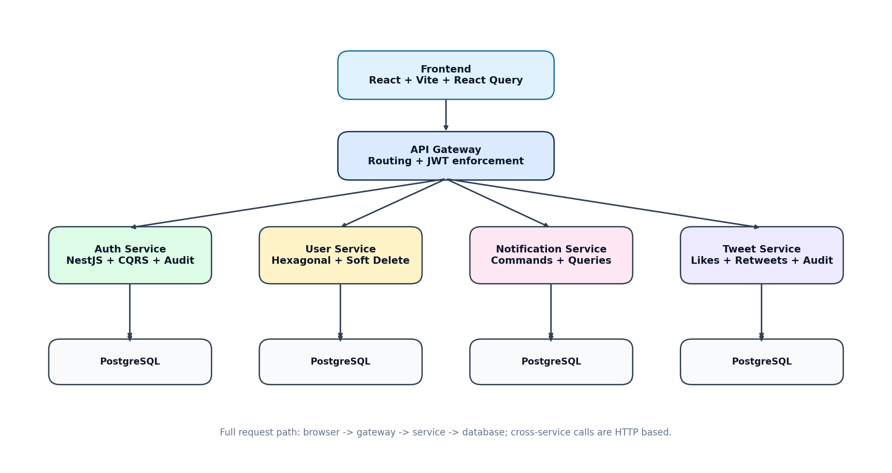
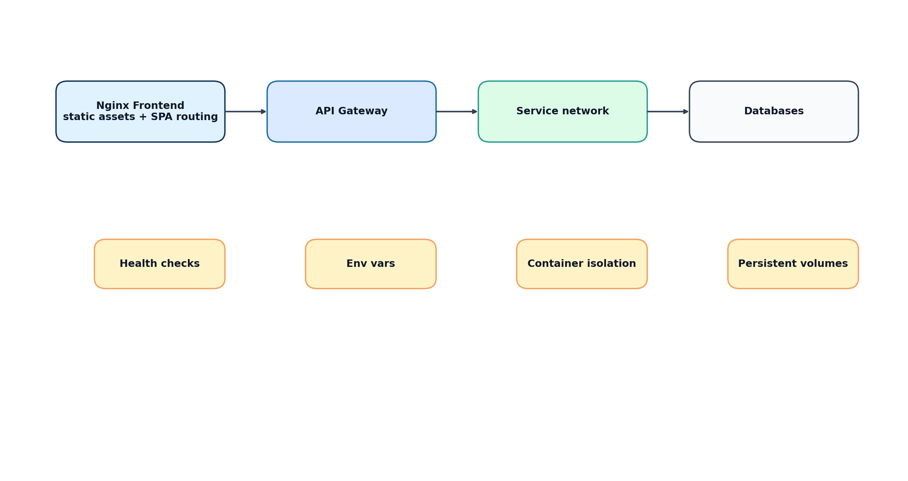
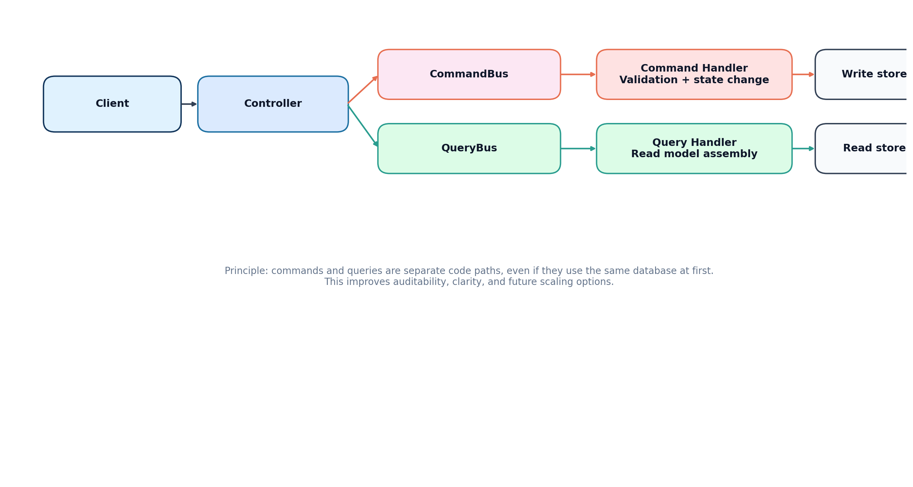
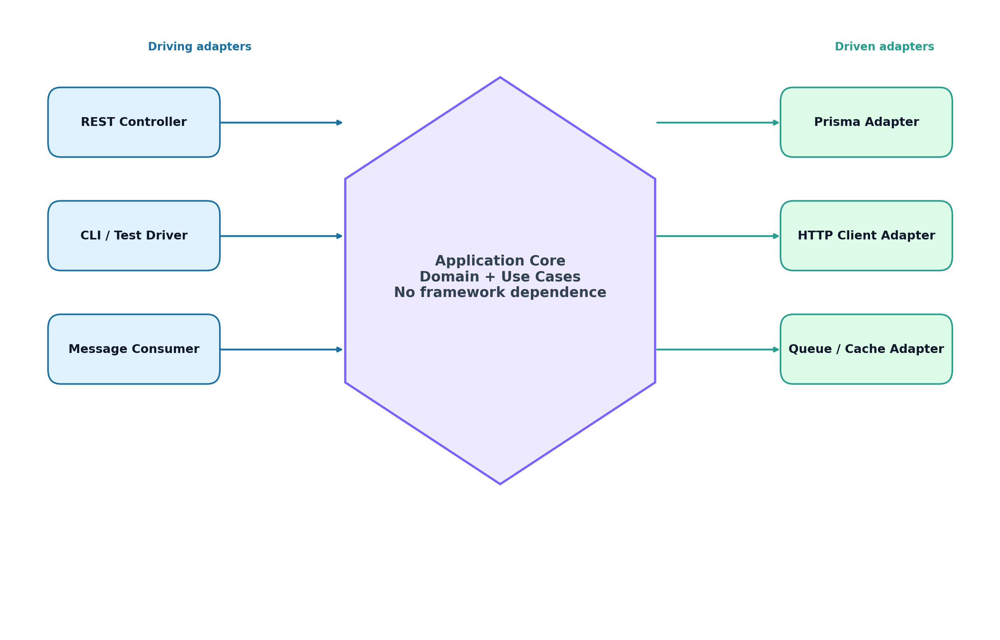

# Design Patterns Guide For Full-Stack Boilerplate

> A presentation-oriented guide to understanding how design patterns appear, or should appear, in this microservices project.

This document is separate from the main README. Its purpose is explanation, teaching, and presentation. It is intentionally more vivid and more pattern-focused than a normal setup guide.

It covers:

- what design patterns are and why they matter
- which patterns are already visible in this codebase
- the five main creational patterns
- Object Pool as a bonus pattern closely related to backend resource management
- how each pattern maps to the real services and files in this project
- small syntax examples for understanding and presentation use

## Table Of Contents

1. [Project Context](#1-project-context)
2. [What Are Design Patterns](#2-what-are-design-patterns)
3. [Why Patterns Matter In This Project](#3-why-patterns-matter-in-this-project)
4. [Patterns Already Present In The Codebase](#4-patterns-already-present-in-the-codebase)
5. [Creational Patterns Overview](#5-creational-patterns-overview)
6. [Singleton Pattern](#6-singleton-pattern)
7. [Factory Method Pattern](#7-factory-method-pattern)
8. [Abstract Factory Pattern](#8-abstract-factory-pattern)
9. [Builder Pattern](#9-builder-pattern)
10. [Prototype Pattern](#10-prototype-pattern)
11. [Object Pool Pattern](#11-object-pool-pattern)
12. [How These Patterns Fit CQRS And Hexagonal Architecture](#12-how-these-patterns-fit-cqrs-and-hexagonal-architecture)
13. [Presentation Summary](#13-presentation-summary)
14. [Appendix: Useful File Map](#14-appendix-useful-file-map)

## 1. Project Context

Full-Stack Boilerplate is a microservices-based social-platform reference system built with:

- NestJS backend services
- React frontend
- Prisma ORM
- PostgreSQL databases
- Docker Compose orchestration
- JWT authentication
- CQRS
- Hexagonal Architecture
- audit logging, search, pagination, and gateway-based edge security

### Services In This Project

- `auth-service/`
- `user-service/`
- `tweet-service/`
- `notification-service/`
- `media-service/`
- `api-gateway/`
- `frontend/`

### Runtime View





The system is deliberately split into focused services. That matters for design patterns, because object creation and resource sharing are no longer local concerns inside one monolith. A pattern that looks small in a single application becomes strategically important once services own their own databases, handlers, repositories, and bootstrapping rules.

## 2. What Are Design Patterns

Design patterns are recurring solution shapes for recurring software design problems.

They are not libraries.
They are not frameworks.
They are not magic shortcuts.

They are reusable design ideas.

A pattern helps answer this kind of question:

- when should one object control creation of another object?
- when should there be only one shared instance?
- when should complex construction happen step by step?
- when should we clone an existing object instead of rebuilding it from zero?

The core value of a pattern is not that it makes code look academic. The value is that it gives developers a shared mental model. Instead of saying, “this class is doing too much weird setup work,” a team can say, “this is a good place for a Factory Method” or “this should probably be a Builder.”

### Three Major Families Of Design Patterns

| Family | Main Concern | Typical Question |
|---|---|---|
| Creational | How objects/resources are created | Who should create this object, and how? |
| Structural | How parts are assembled | How should these pieces be connected? |
| Behavioral | How objects communicate | How should responsibilities and interactions flow? |

This guide focuses on **Creational Patterns**, because they are the clearest next step for this codebase.

## 3. Why Patterns Matter In This Project

In small code samples, object creation seems trivial. In real backend systems, creation logic becomes one of the main sources of hidden complexity.

This project already shows why.

### Real Design Pressures In The Codebase

- Every backend service has its own `PrismaService`.
- The gateway reads and combines multiple service URLs.
- Tweet creation has validation and optional fields.
- Retweet creation derives from an existing tweet.
- Notification creation depends on event type and possibly future delivery channels.
- The frontend has a refresh-token queue, which is itself a good example of controlled resource flow.

### Without Patterns, These Problems Usually Turn Into

- large constructors
- duplicated setup logic
- repeated `process.env` reads everywhere
- hard-coded `switch` statements in handlers
- accidental over-creation of expensive resources
- code that works today but becomes fragile when features grow

Design patterns do not remove complexity. They **organize** it.

## 4. Patterns Already Present In The Codebase

Before talking about new creational patterns, it is important to recognize that this project already uses several strong patterns.

### Repository Pattern

Repository contracts exist in the domain layer and are implemented in infrastructure.

Examples:

- `tweet-service/src/domain/repositories/tweet.repository.interface.ts`
- `user-service/src/domain/repositories/user.repository.interface.ts`
- `notification-service/src/domain/repositories/notification.repository.interface.ts`
- `media-service/src/domain/repositories/media.repository.interface.ts`

Repository implementations:

- `tweet-service/src/infrastructure/persistence/prisma-tweet.repository.ts`
- `user-service/src/infrastructure/persistence/prisma-user.repository.ts`
- `notification-service/src/infrastructure/persistence/prisma-notification.repository.ts`
- `media-service/src/infrastructure/persistence/prisma-media.repository.ts`

Why it matters: this is what keeps domain and application logic from depending directly on Prisma queries.

### Dependency Injection

NestJS modules wire collaborators together through providers and constructor injection.

Examples:

- `tweet-service/src/app.module.ts`
- `notification-service/src/app.module.ts`
- `media-service/src/app.module.ts`
- `api-gateway/src/app.module.ts`

Why it matters: creational patterns are much easier to use cleanly when the framework already supports dependency wiring.

### CQRS Pattern

Commands and queries are separated in the application layer.

Examples:

- `tweet-service/src/application/handlers/tweet-crud.handler.ts`
- `tweet-service/src/application/handlers/tweet-social.handler.ts`
- `tweet-service/src/application/handlers/tweet-query.handler.ts`
- `notification-service/src/application/handlers/notification.handler.ts`
- `notification-service/src/application/handlers/notification-query.handler.ts`
- `media-service/src/application/handlers/upload-media.handler.ts`
- `media-service/src/application/handlers/media-query.handler.ts`



Why it matters: creational patterns should help the command side and infrastructure side without breaking the command/query separation.

### API Gateway Pattern

The API Gateway is the single public entry point and centralizes cross-cutting concerns.

Examples:

- `api-gateway/src/main.ts`
- `api-gateway/src/app.service.ts`
- `api-gateway/src/auth-proxy/`
- `api-gateway/src/users-proxy/`
- `api-gateway/src/tweets-proxy/`
- `api-gateway/src/notifications-proxy/`
- `api-gateway/src/media-proxy/`

Why it matters: the gateway is a strong candidate for Abstract Factory because it already manages environment-specific behavior and service composition.

### Domain-Driven Design Elements

This project also already uses DDD-style building blocks.

Entities:

- `auth-service/src/domain/entities/auth-user.entity.ts`
- `user-service/src/domain/entities/user-profile.entity.ts`
- `tweet-service/src/domain/entities/tweet.entity.ts`
- `notification-service/src/domain/entities/notification.entity.ts`
- `media-service/src/domain/entities/media.entity.ts`

Value objects:

- `auth-service/src/domain/value-objects/email.vo.ts`
- `tweet-service/src/domain/value-objects/tweet-content.vo.ts`



Why it matters: Builder and Prototype fit naturally near entities and other domain creation rules.

## 5. Creational Patterns Overview

Creational patterns answer one central question:

**How should objects or resources be created so that the rest of the system stays clean?**

### The Five Main Creational Patterns

| Pattern | Main Idea | Best Fit In This Project |
|---|---|---|
| Singleton | One shared instance | Prisma client per service process |
| Factory Method | Let a creator decide concrete product type | notification creation strategy |
| Abstract Factory | Create related families of objects | environment-specific configuration |
| Builder | Construct complex objects step by step | tweet creation with optional fields |
| Prototype | Create by cloning an existing object | retweet derivation |

### Bonus Pattern

| Pattern | Why It Matters Here |
|---|---|
| Object Pool | Controlled reuse of expensive resources like database clients or client leases |

## 6. Singleton Pattern

### Definition

Singleton ensures that a class has only one active instance in a given scope and provides a single controlled access point to it.

### Vivid Analogy

Imagine a building with one central water tank on each floor. Every room can use the water, but the floor should not build a new tank every time someone opens a tap. One tank is enough, as long as access is controlled.

### Why Singleton Exists

Some objects are expensive, sensitive, or logically unique:

- database clients
- configuration registries
- structured loggers
- shared caches

The problem is not simply memory usage. The real problem is **coordination**. Multiple uncontrolled instances can lead to duplicated initialization, inconsistent state, and unnecessary resource pressure.

### Syntax Shape

```ts
class ExampleSingleton {
  private static instance: ExampleSingleton;

  private constructor() {}

  static getInstance(): ExampleSingleton {
    if (!ExampleSingleton.instance) {
      ExampleSingleton.instance = new ExampleSingleton();
    }
    return ExampleSingleton.instance;
  }
}
```

### Project Mapping

Current real files:

- `auth-service/src/prisma.service.ts`
- `user-service/src/prisma.service.ts`
- `tweet-service/src/prisma.service.ts`
- `notification-service/src/prisma.service.ts`
- `media-service/src/prisma.service.ts`

Current codebase status:

- the project already centralizes Prisma access inside one service class per microservice
- the pattern is **implicitly present**
- it is not yet documented or made explicit as a formal Singleton implementation

### Why This Is The Right Fit Here

Each microservice is a separate Node.js process inside its own container. That means “one instance” should be interpreted as:

**one Prisma client per microservice process**, not one global Prisma client for the entire system.

That is the correct architectural boundary.

### Project Example

Current style:

```ts
export class PrismaService extends PrismaClient implements OnModuleInit, OnModuleDestroy {
  async onModuleInit() {
    await this.$connect();
  }
}
```

Presentation explanation:

- PrismaService acts as the central database client entry point
- repositories inject it instead of creating their own Prisma clients
- this is already close to Singleton behavior

### ASCII Diagram

```text
TweetRepository  ----\
AuditService      ----> PrismaService ----> Shared PrismaClient
UserRepository    ----/
```

### Best Talking Point For Presentation

“Singleton is valuable here because database access is a shared infrastructure concern. Repositories should use one controlled client instead of creating their own clients independently.”

### Verification In This Project

- repositories do not instantiate PrismaClient directly
- Prisma access is centralized in `prisma.service.ts`
- lifecycle hooks manage connection setup and teardown

## 7. Factory Method Pattern

### Definition

Factory Method defines an interface for creating an object, but lets subclasses or specialized creators decide which concrete object to create.

### Vivid Analogy

Think of a restaurant kitchen. A customer says, “I want a drink,” but does not walk into the kitchen to decide which machine, glass, or recipe should be used. The drink station decides whether to prepare coffee, tea, or juice.

The customer requests a category.
The creator decides the concrete form.

### Why Factory Method Exists

When a piece of application logic must create different variants of something, a naive design often ends up with:

- growing `if/else` chains
- `switch` statements inside handlers
- repeated setup rules
- creation logic mixed with business flow logic

Factory Method separates the two concerns:

- caller says what is needed
- factory decides how to create it

### Syntax Shape

```ts
interface NotificationStrategy {
  send(): void;
}

class NotificationFactory {
  create(channel: 'in-app' | 'email' | 'push'): NotificationStrategy {
    throw new Error('implemented by concrete factory');
  }
}
```

### Project Mapping

Current real files showing the need:

- `notification-service/src/application/handlers/notification.handler.ts`
- `notification-service/src/application/commands/notification.commands.ts`
- `notification-service/src/infrastructure/http/notifications.controller.ts`

Current codebase status:

- notification creation is currently direct and handler-driven
- concrete notification variants are not yet delegated to a factory
- this pattern is **not explicitly implemented yet**, but the notification service is the clearest place for it

### Why This Is The Right Fit Here

The notification service already has a clean command-based entry point:

- `SendNotificationCommand`
- `SendNotificationHandler`

That means the command handler can stay focused on orchestration while a factory decides how to create:

- in-app notification payloads
- future email notification payloads
- future push notification payloads

### Project Example

Current style in the handler:

```ts
const notif = await this.repo.create({
  userId: command.userId,
  fromUserId: command.fromUserId,
  type: command.type,
  title: command.title,
  body: command.body,
});
```

Factory-oriented explanation:

```ts
const strategy = notificationFactory.create(command.type);
const payload = strategy.build(command);
const notif = await repo.create(payload);
```

This is the important presentation message: the handler should coordinate, not micromanage creation details.

### ASCII Diagram

```text
SendNotificationHandler
        |
        v
NotificationFactory.create(type)
   |            |             |
   v            v             v
InApp       Email         Push
```

### Best Talking Point For Presentation

“Factory Method cleans up the notification handler by moving variant-specific creation logic into dedicated creators or strategies.”

### Verification In This Project

- command handler should stop manually assembling all variants
- adding a new delivery mode should require new creator logic, not handler rewrites
- repository remains unchanged

## 8. Abstract Factory Pattern

### Definition

Abstract Factory creates families of related objects without specifying their concrete classes at the usage site.

### Vivid Analogy

A gaming company ships three console bundles: Developer Edition, QA Edition, and Production Edition. Each bundle contains a matched set of accessories, settings, cables, and software switches. The buyer chooses a bundle, not each part individually.

That is the essence of Abstract Factory:

- choose one family
- receive a consistent group of related objects

### Why Abstract Factory Exists

The problem is not just “configuration exists.”
The problem is “configuration belongs together.”

For example, a production environment may require:

- stricter CORS
- different service URLs
- stronger logging rules
- different health-check expectations
- hardened security defaults

If these rules are read one variable at a time from scattered `process.env` calls, the environment becomes fragmented. Abstract Factory groups them into one coherent runtime family.

### Syntax Shape

```ts
interface EnvironmentFactory {
  createUrls(): UrlConfig;
  createSecurity(): SecurityConfig;
  createLogging(): LoggingConfig;
}
```

### Project Mapping

Current real files showing the need:

- `api-gateway/src/main.ts`
- `api-gateway/src/app.service.ts`
- `tweet-service/src/application/handlers/tweet-crud.handler.ts`
- `tweet-service/src/application/handlers/tweet-social.handler.ts`

Current codebase status:

- environment reads are currently explicit and distributed
- the gateway is the strongest first candidate for Abstract Factory
- the pattern is **architecturally appropriate but not yet formalized**

### Why This Is The Right Fit Here

The gateway already groups environment-sensitive concerns:

- upstream service URLs
- CORS configuration
- security headers
- health aggregation
- metrics exposure

That makes it the ideal place to say:

- dev factory returns development-safe settings
- staging factory returns pre-production settings
- prod factory returns hardened settings

### Project Example

Current style:

```ts
const UPSTREAM = {
  auth: process.env.AUTH_SERVICE_URL ?? 'http://localhost:3001',
  users: process.env.USER_SERVICE_URL ?? 'http://localhost:3002',
};
```

Abstract Factory explanation:

```ts
const envFactory = resolveFactory(process.env.NODE_ENV);
const upstream = envFactory.createUrls();
const security = envFactory.createSecurity();
```

### ASCII Diagram

```text
ConfigResolver
     |
     +--> DevFactory ------> URLs, CORS, Logging
     +--> StagingFactory --> URLs, CORS, Logging
     +--> ProdFactory -----> URLs, CORS, Logging
```

### Best Talking Point For Presentation

“Abstract Factory helps the gateway think in environment packages instead of isolated variables.”

### Verification In This Project

- fewer repeated `process.env` reads in runtime logic
- related settings come from one chosen environment family
- bootstrap code becomes easier to explain and audit

## 9. Builder Pattern

### Definition

Builder separates the construction of a complex object from its final representation so that the same construction process can create valid objects step by step.

### Vivid Analogy

Think about assembling a travel itinerary. You do not create it in one giant unreadable sentence. You add destination, dates, hotel, transport, insurance, and optional notes one step at a time until the plan is complete.

Builder is ideal when an object has:

- required fields
- optional fields
- validation needs
- future extensibility pressure

### Why Builder Exists

Without Builder, complex domain creation often turns into one of these:

- a huge constructor with too many arguments
- argument order bugs
- unreadable code like `new Thing(a, b, c, d, e, f, g)`
- optional fields passed as `null, null, [], undefined`

Builder makes the creation path readable.

### Syntax Shape

```ts
const tweet = new TweetBuilder()
  .withUserId(userId)
  .withContent(content)
  .withMediaUrls(mediaUrls)
  .build();
```

### Project Mapping

Current real files showing the need:

- `tweet-service/src/domain/entities/tweet.entity.ts`
- `tweet-service/src/application/handlers/tweet-crud.handler.ts`
- `tweet-service/src/infrastructure/persistence/prisma-tweet.repository.ts`

Current codebase status:

- tweet construction is currently constructor-based and repository-driven
- the domain already has clear entity and value-object boundaries
- Builder is **not yet explicitly implemented**, but tweet creation is the strongest place for it

### Why This Is The Right Fit Here

The Tweet entity already contains several fields:

- `id`
- `userId`
- `content`
- `mediaUrls`
- `likesCount`
- `retweetsCount`
- `originalTweetId`
- `createdAt`
- `updatedAt`
- `deletedAt`

And that is before future fields like:

- mentions
- hashtags
- location
- quote metadata
- visibility flags

Builder gives the tweet domain room to grow without turning construction into noise.

### Project Example

Current entity shape:

```ts
export class Tweet {
  constructor(
    public readonly id: string,
    public readonly userId: string,
    public readonly content: string,
    public readonly mediaUrls: string[],
    public readonly likesCount: number,
    public readonly retweetsCount: number,
    public readonly originalTweetId: string | null,
    public readonly createdAt: Date,
    public readonly updatedAt: Date,
    public readonly deletedAt: Date | null,
  ) {}
}
```

Builder-oriented explanation:

```ts
const draft = new TweetBuilder()
  .withUserId(command.userId)
  .withContent(validatedContent.value)
  .withMediaUrls(command.mediaUrls)
  .build();
```

### ASCII Diagram

```text
TweetBuilder
  .withUserId(...)
  .withContent(...)
  .withMediaUrls(...)
  .withOriginalTweetId(...)
  .build()
        |
        v
      Tweet
```

### Best Talking Point For Presentation

“Builder is useful when the domain object is real and important, but its construction is becoming too verbose or too fragile.”

### Verification In This Project

- fewer long constructor calls
- better readability in handlers and repository mappers
- optional tweet fields become easier to extend safely

## 10. Prototype Pattern

### Definition

Prototype creates new objects by copying an existing object and then adjusting the copied version as needed.

### Vivid Analogy

A graphic designer duplicates an existing poster file before making a campaign variation. The new poster starts from a working design and only changes the title, date, or color accents.

Prototype works best when a new object is conceptually based on an existing one.

### Why Prototype Exists

Sometimes creation is really derivation.

Retweeting is a strong example:

- there is already an original tweet
- the new tweet is related to it
- some values should be copied
- some values should be overridden

That is exactly where Prototype thinking is valuable.

### Syntax Shape

```ts
const retweet = originalTweet.cloneForRetweet(newUserId, comment);
```

### Project Mapping

Current real files showing the need:

- `tweet-service/src/domain/entities/tweet.entity.ts`
- `tweet-service/src/application/handlers/tweet-social.handler.ts`

Current codebase status:

- the `Tweet` entity already expresses retweet identity through `originalTweetId`
- the handler currently creates retweets procedurally
- Prototype is **not explicit yet**, but retweet flow is the clearest match

### Why This Is The Right Fit Here

The retweet handler already starts with the original tweet:

```ts
const original = await this.tweetRepo.findById(command.originalTweetId);
```

That means the code naturally has a source object available. Instead of rebuilding retweet state manually, the domain can provide clone-based derivation.

### Project Example

Current style:

```ts
const retweet = await this.tweetRepo.create(
  command.userId,
  command.comment || `RT: ${original.content.slice(0, 240)}`,
  [],
  command.originalTweetId,
);
```

Prototype-oriented explanation:

```ts
const draft = original.cloneForRetweet(command.userId, command.comment);
const retweet = await this.tweetRepo.createFromDraft(draft);
```

### ASCII Diagram

```text
Original Tweet
      |
      +--> cloneForRetweet(userId, comment)
                     |
                     v
               Retweet Draft
```

### Best Talking Point For Presentation

“Prototype is the most natural pattern when a new domain object is a variation of an existing domain object.”

### Verification In This Project

- retweet creation should begin from the original tweet object
- derivation rules should live in one place
- retweet flow should become easier to explain in domain terms

## 11. Object Pool Pattern

### Definition

Object Pool manages a reusable set of expensive objects and hands them out on demand instead of creating a fresh object every time.

### Vivid Analogy

At a university media lab, students borrow cameras from an equipment desk. The lab does not buy a new camera every time someone wants to shoot a video. It reuses a managed pool of cameras, tracks which ones are checked out, and returns them to circulation afterward.

### Why Object Pool Exists

Some objects are expensive to create or expensive to dispose of repeatedly.

Typical examples:

- database connections
- thread workers
- parser engines
- connection clients

Pooling improves:

- reuse
- predictability
- controlled concurrency
- monitoring of active vs idle resources

### Important Precision For This Project

Prisma already manages low-level database connection pooling internally.

So in this project, Object Pool should be explained carefully:

- not as a replacement for Prisma internals
- but as an educational and architectural pattern around reusable client access or client leases

### Syntax Shape

```ts
const lease = pool.acquire();
try {
  // use pooled resource
} finally {
  pool.release(lease);
}
```

### Project Mapping

Current real files that mark the resource boundary:

- `auth-service/src/prisma.service.ts`
- `user-service/src/prisma.service.ts`
- `tweet-service/src/prisma.service.ts`
- `notification-service/src/prisma.service.ts`
- `media-service/src/prisma.service.ts`

Current codebase status:

- resource access is centralized
- pooling is not explicitly modeled in project code
- Object Pool is best treated as a **teaching-friendly extension around Prisma access**, not as raw socket-pool replacement

### Why This Is The Right Fit Here

This project is microservice-heavy, database-backed, and infrastructure-conscious. That makes it a very good educational case for Object Pool, even if Prisma already handles the deepest layer.

The right explanation is:

- Singleton controls the main shared client instance per service
- Object Pool controls reusable access to expensive client resources or leases

### Project Example

Conceptual project example:

```ts
const client = prismaClientPool.acquire();
await client.user.findUnique({ where: { id } });
prismaClientPool.release(client);
```

### ASCII Diagram

```text
Repository -> PrismaService -> PrismaClientPool.acquire()
                               |           |
                               |           +--> reuse idle client
                               |
                               +--> create/lease if available
                                      |
                                      v
                                   use client
                                      |
                                      v
                              PrismaClientPool.release()
```

### Best Talking Point For Presentation

“Object Pool is about controlled reuse of expensive objects. In this codebase, the safest educational form is a pool around client access, while Prisma continues to own real DB connection pooling internally.”

### Verification In This Project

- centralized acquire/release API
- visible pool state such as active and idle resources
- explicit documentation that Prisma still manages low-level DB pooling

## 12. How These Patterns Fit CQRS And Hexagonal Architecture

This is the most important architectural point in the whole guide.

Patterns should not be added randomly. They should respect the existing layering.

### Correct Placement By Layer

| Pattern | Best Layer |
|---|---|
| Singleton | Infrastructure |
| Factory Method | Application or domain-adjacent creation layer |
| Abstract Factory | Bootstrap / infrastructure configuration |
| Builder | Domain construction layer |
| Prototype | Domain entity behavior or domain helper |
| Object Pool | Infrastructure |

### Why This Placement Matters

If Singleton leaks into handlers, the application layer becomes infrastructure-aware.

If Factory Method lives in controllers, HTTP delivery concerns start owning business creation logic.

If Builder lives inside Prisma adapters only, the domain misses the chance to express its own construction rules.

If Abstract Factory is spread across handlers, environment behavior becomes fragmented again.

The rule is simple:

**put each pattern where its responsibility naturally belongs.**

### Visual Summary

```text
Controller / Guard
   -> CommandBus / QueryBus
   -> Handler
   -> Repository Port
   -> Prisma Adapter
   -> Database

Singleton, Object Pool  -> Infrastructure
Factory Method          -> Application/domain seam
Builder, Prototype      -> Domain creation logic
Abstract Factory        -> Bootstrap/configuration
```

## 13. Presentation Summary

If you are presenting this project, the clearest short summary is:

1. The project already uses Repository, Dependency Injection, CQRS, and API Gateway patterns.
2. The next architectural improvement is to make creation logic explicit with creational patterns.
3. Singleton fits Prisma access.
4. Factory Method fits notification creation.
5. Abstract Factory fits environment-aware gateway and service configuration.
6. Builder fits tweet construction.
7. Prototype fits retweet derivation.
8. Object Pool fits controlled reuse of expensive database-related client resources.

### One-Sentence Summary Per Pattern

- Singleton: one shared database client per service process.
- Factory Method: let the notification creator decide the concrete notification strategy.
- Abstract Factory: package environment behavior into coherent families.
- Builder: assemble tweets step by step instead of forcing giant constructors.
- Prototype: derive retweets by cloning original tweets.
- Object Pool: reuse expensive client resources through a controlled pool.

## 14. Appendix: Useful File Map

### Best Files To Show In A Demo Or Presentation

Architecture and deployment:

- `docker-compose.yml`
- `docker-compose.prod.yml`
- `ARCHITECTURE.md`

Gateway and integration:

- `api-gateway/src/main.ts`
- `api-gateway/src/app.module.ts`
- `api-gateway/src/app.service.ts`

Tweet service as the best domain example:

- `tweet-service/src/app.module.ts`
- `tweet-service/src/domain/entities/tweet.entity.ts`
- `tweet-service/src/domain/value-objects/tweet-content.vo.ts`
- `tweet-service/src/application/handlers/tweet-crud.handler.ts`
- `tweet-service/src/application/handlers/tweet-social.handler.ts`
- `tweet-service/src/infrastructure/persistence/prisma-tweet.repository.ts`

Notification service as the best Factory Method candidate:

- `notification-service/src/application/commands/notification.commands.ts`
- `notification-service/src/application/handlers/notification.handler.ts`
- `notification-service/src/infrastructure/http/notifications.controller.ts`

Prisma access for Singleton and Object Pool discussion:

- `auth-service/src/prisma.service.ts`
- `user-service/src/prisma.service.ts`
- `tweet-service/src/prisma.service.ts`
- `notification-service/src/prisma.service.ts`
- `media-service/src/prisma.service.ts`

Frontend integration example:

- `frontend/src/api/axios.ts`

Why `frontend/src/api/axios.ts` is interesting:

- it shows a refresh-token request queue
- it demonstrates controlled sequencing of shared auth state
- while it is not one of the creational patterns covered here, it is an excellent example of clean real-world coordination logic in the frontend

---

## Final Thought

The strongest lesson from this project is that design patterns are most useful when they are tied to real pressure points.

This codebase is already large enough to justify them.
It already has the architectural skeleton.
What creational patterns add is not “more code.”

They add:

- clearer creation rules
- clearer ownership of object construction
- clearer resource lifecycle management
- clearer explanation value for readers, reviewers, and presentation audiences

That is why this project is a very good teaching example for creational design patterns.